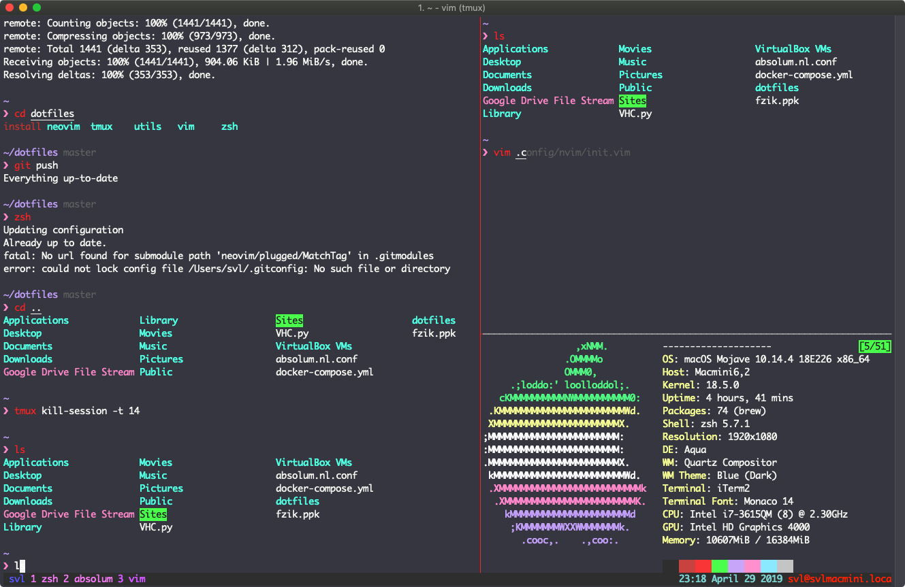
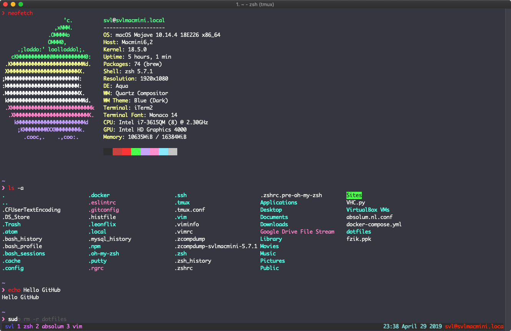
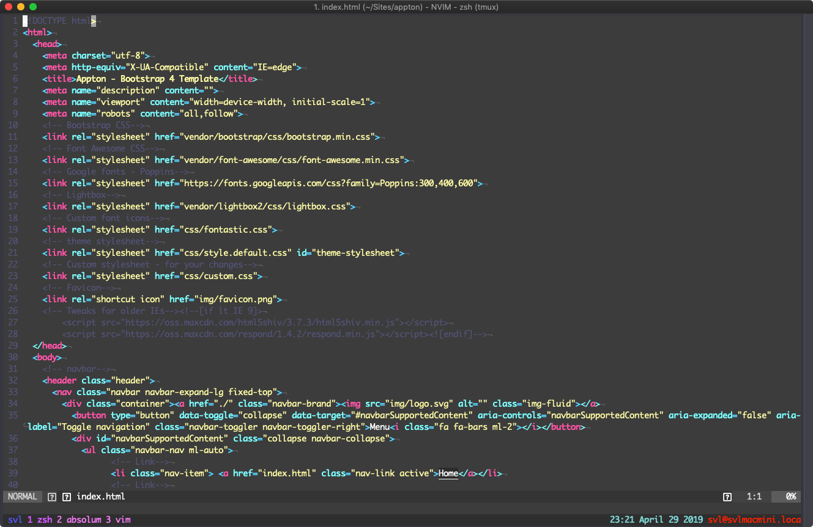

<p align="center"><a href="https://github.com/absolum1"
target="_blank"><br></a></p>


<h1 align="center">Dotfiles</h1>


<p align="center">Easy to edit dotfiles setup, with an install script.</p>



## Tags
- :page_facing_up: Template
- :closed_book: Educational
- :necktie: Professional
- 🎉 Open source

## Warning
- Back-up your files if your not familiar with dotfile setups, the installation will do that for you.
- It only works on Unix based operating systems, if you want to use it on windows use Windows Subsystem for Linux (WSL).
- I do not deliver any type of support for these files, so if something breaks it's your own problem.

## Install
1. git clone the repository to your user directory
   ```https://github.com/svliantiss/dotfiles.git```
2. cd into dotfiles
   ```cd dotfiles```
3. Install the dotfiles
   ```./install```
4. Follow the intructions and your done!

## Key Features
#### ZSH
- oh-my-zsh
- zsh-autocomplete
- automatic ls afer cd (super handy)
- ZSH Pure theme
#### NeoVim
- Startify
- Tab suggestions
- Fuzzy finder
- Snazzy theme
#### Tmux
- Tmux Resurrect
- Costum Tmux theme
- Vim Mode
- Vim like shortcuts (Host + HJKL for moving splits, Creating splits with Host + - or |)

## Editing
- I recommend making a Unix based VM and use snapshots to test and edit your own builds.
- All the files are easy to follow and edit, if you use the method I recommended there shouldn't be any problems.

## Issues
- For some reason after installing the extensions via :PlugInstall & Host+I. Git seems to want to add everything into a
  .gitmodules file giving the fatal path is not known for this submodule error, this can be safely ignored if you want
  the error to go away you can use ```git rm -r --cache . -f``` to remove the message.
- Icons might not be working, this is a known issue with devicons, make sure you have NERD font installed (I recommend
  Droid Sans Mono NF), I will update the repository with a fix if there is one.

# Pictures



## MIT-License
Copyright 2019 Wesly Nouse

Permission is hereby granted, free of charge, to any person obtaining a copy of this software and associated documentation files (the "Software"), to deal in the Software without restriction, including without limitation the rights to use, copy, modify, merge, publish, distribute, sublicense, and/or sell copies of the Software, and to permit persons to whom the Software is furnished to do so, subject to the following conditions:

The above copyright notice and this permission notice shall be included in all copies or substantial portions of the Software.

THE SOFTWARE IS PROVIDED "AS IS", WITHOUT WARRANTY OF ANY KIND, EXPRESS OR IMPLIED, INCLUDING BUT NOT LIMITED TO THE WARRANTIES OF MERCHANTABILITY, FITNESS FOR A PARTICULAR PURPOSE AND NONINFRINGEMENT. IN NO EVENT SHALL THE AUTHORS OR COPYRIGHT HOLDERS BE LIABLE FOR ANY CLAIM, DAMAGES OR OTHER LIABILITY, WHETHER IN AN ACTION OF CONTRACT, TORT OR OTHERWISE, ARISING FROM, OUT OF OR IN CONNECTION WITH THE SOFTWARE OR THE USE OR OTHER DEALINGS IN THE SOFTWARE.


